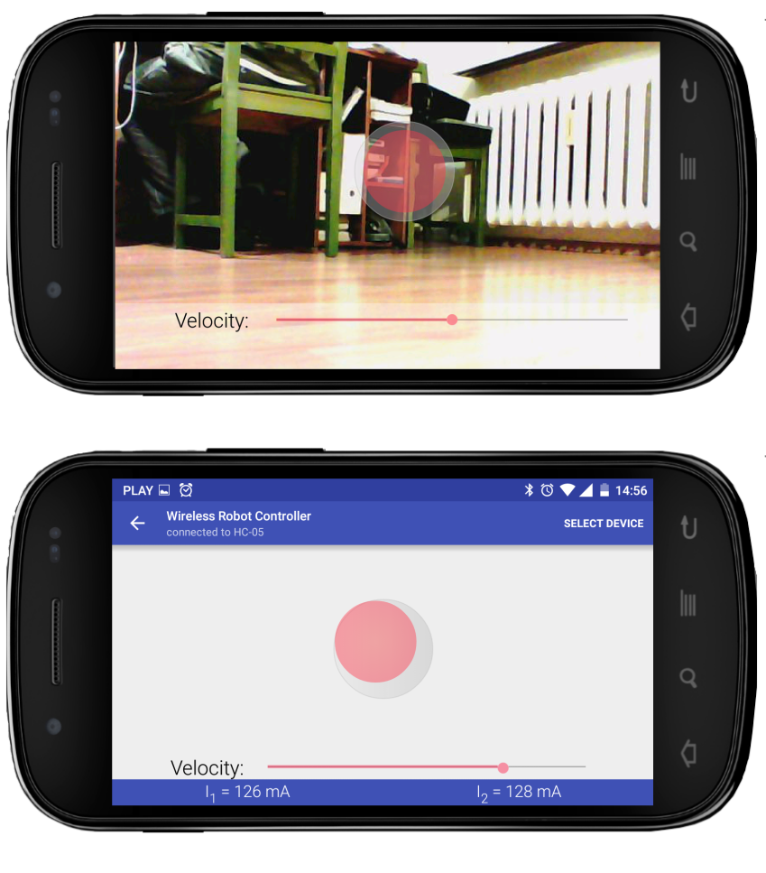

# RobotController

App which allows to controll the robot using Bluetooth or Wifi. When using Wifi it displays image from camera placed on the robot. 
The image sent from camera in MJPEG format which unfortunately [is not supported by Android](https://developer.android.com/guide/appendix/media-formats.html).

    

